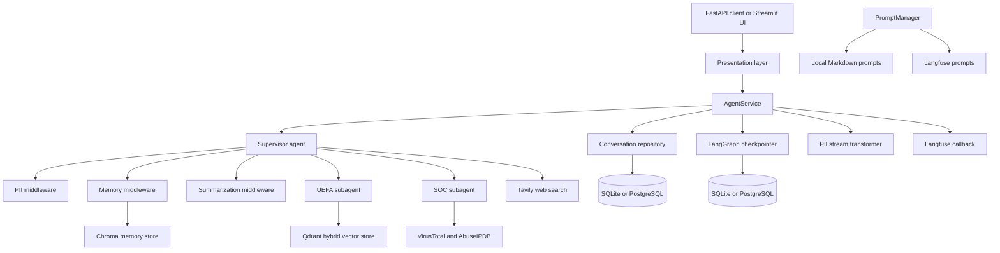

# Base Agent LangChain

Reference implementation of a LangChain/LangGraph application with a supervisor agent and two specialist agents:

- **UEFA agent**: answers questions about UEFA football competitions using a hybrid RAG pipeline.
- **SOC agent**: performs security-oriented tasks such as IP reputation checks, indicator analysis, and IP blacklist management.

The project is deliberately structured as an extensible base rather than a single-purpose chatbot. It includes conversation checkpoints, conversation persistence, semantic user memory, PII protection, prompt versioning, human approval for sensitive tools, Langfuse tracing, and two presentation modes: FastAPI and Streamlit.

## 📚 Contents

- [Base Agent LangChain](#base-agent-langchain)
  - [📚 Contents](#-contents)
  - [🏗️ Architecture](#️-architecture)
  - [🗂️ Repository structure](#️-repository-structure)
  - [🔄 Runtime lifecycle](#-runtime-lifecycle)
  - [🔀 Request flows](#-request-flows)
    - [FastAPI invocation](#fastapi-invocation)
    - [Streamlit invocation](#streamlit-invocation)
    - [Supervisor delegation](#supervisor-delegation)
  - [🤖 Agents](#-agents)
    - [Supervisor](#supervisor)
    - [UEFA agent and RAG](#uefa-agent-and-rag)
    - [SOC agent](#soc-agent)
  - [🧩 Cross-cutting middleware](#-cross-cutting-middleware)
    - [Memory](#memory)
    - [PII protection](#pii-protection)
    - [Summarization](#summarization)
  - [💾 Persistence and integrations](#-persistence-and-integrations)
  - [📝 Prompt management](#-prompt-management)
  - [⚙️ Configuration](#️-configuration)
  - [💻 Local setup](#-local-setup)
  - [🐳 Docker setup](#-docker-setup)
  - [📥 UEFA document ingestion](#-uefa-document-ingestion)
  - [🌐 API](#-api)
  - [🛠️ Development notes](#️-development-notes)
  - [🤝 Contributing](#-contributing)
  - [📄 License](#-license)

## 🏗️ Architecture



The application has three important boundaries:

1. **Presentation** translates HTTP or Streamlit interactions into typed agent requests.
2. **Services** coordinate graph execution, persistence, streaming, and human-in-the-loop commands.
3. **Agents and core components** implement reasoning, retrieval, memory, PII handling, prompts, and external tools.

The `setup()` context manager is the composition root. It creates the database connection, checkpointer, memory store, memory extractor, PII handler, stream transformer, conversation repository, and supervisor graph, then disposes them together.

## 🗂️ Repository structure

```text
src/
├── agents/
│   ├── supervisor/       Supervisor graph and delegation tools
│   ├── uefa_agent/       UEFA RAG agent, Qdrant store, retriever tool
│   └── soc_agent/        SOC agent and security/blacklist tools
├── core/
│   ├── config.py         Pydantic settings loaded from environment variables
│   ├── memory/           Chroma-backed memory and LLM extraction middleware
│   ├── pii/               Presidio detection, vault, and stream transformation
│   ├── prompt/            PromptManager and prompt source selection
│   └── langfuse_resources.py
├── dtos/                 Request, response, conversation, and pagination models
├── persistence/          SQL models, LangChain message parsing, repositories
├── presentation/
│   ├── api/              FastAPI app, routers, middleware, optional A2A routes
│   └── ui/               Streamlit app and threaded runtime adapter
├── prompts/              Local Markdown prompt templates
├── services/             Agent, conversation, and memory application services
├── setup.py              Dependency-injection and resource lifecycle assembly
├── utils/                Message, RAG, pagination, singleton, and RFC helpers
└── main.py               API/Streamlit process entrypoint

scripts/load_uefa_docs.py    One-time/idempotent UEFA document ingestion
data/uefa_docs/              Source PDFs for the UEFA knowledge base
docker-compose*.yml           Local production-like infrastructure
```

## 🔄 Runtime lifecycle

`src/main.py` selects the presentation mode from `PRESENTATION_MODE`:

- `api`: creates the FastAPI application and runs Uvicorn on `REST_SERVER__PORT`.
- `ui`: starts Streamlit with `src/presentation/ui/app.py` on `UI__PORT`.

At startup, `setup()` performs the following sequence:

1. Initializes the SQL database and creates the tables defined by the `Conversation`, `Message`, and `Interrupt` models.
2. Selects the LangGraph checkpointer:
   - `AsyncSqliteSaver` for `SUPERVISOR__ENGINE=sqlite`.
   - `AsyncPostgresSaver` for `SUPERVISOR__ENGINE=postgres`.
3. Runs checkpointer setup/migrations.
4. Initializes Chroma and creates the configured memory collection.
5. Creates the LLM memory extractor.
6. Creates the Spanish Presidio PII handler with an in-memory vault and stream transformer.
7. Builds the supervisor with its tools and middleware.
8. Injects the resulting `AppResources` into the API application or the Streamlit runtime.

The UEFA store is initialized at module import time. It creates the configured Qdrant collection if it does not exist, and is closed when the API lifespan or UI process exits.

## 🔀 Request flows

### FastAPI invocation

For `POST /agent/invoke`:

1. `presentation.api.routers.agent` validates the request as `AgentRequest`.
2. `AgentService.invoke()` loads the checkpoint for the request `thread_id`.
3. If the checkpoint contains pending interrupts, the service either returns them or converts submitted decisions into a LangGraph `Command(resume=...)`.
4. Otherwise, the query becomes a `HumanMessage` in an `AgentState`.
5. The service invokes the supervisor with a runnable configuration containing the thread ID, limits, tags, metadata, and optional Langfuse callback.
6. The final graph message and any interrupts are converted into `AgentResponse`.
7. When a user context is present, LangChain messages are parsed and written to the conversation repository.

`POST /agent/stream` follows the same preparation path but calls `graph.astream(..., stream_mode=['messages'])`. `AgentService` filters model/tool events, transforms streamed PII-safe content, emits `chunk` SSE events, flushes the final buffer, then emits an `end` event with the final response and interrupts.

`GET /agent/state/{thread_id}` reads the LangGraph checkpoint and exposes its messages and pending interrupts without executing the graph.

### Streamlit invocation

The UI uses `AgentRuntime`, a background event-loop/thread adapter around the same `AgentService` and repository:

1. `process_user_message()` appends the human message to the Streamlit session and creates or reuses a UUIDv7 thread ID.
2. `AgentRuntime.stream()` calls `AgentService.stream()` with `Context(user_id=DEFAULT_USER_ID)`.
3. Chat components render chunks as they arrive and render the final response/interrupt state.
4. The first message refreshes the sidebar conversation list.
5. The sidebar can select, reset, or delete threads; deletion removes both the checkpoint and stored conversation.
6. When SOC approval is required, `process_interrupts()` collects decisions from the UI and resumes the same thread.

The API router currently calls the agent service without a `Context`, while the UI supplies `Context(user_id=DEFAULT_USER_ID)`. Consequently, UI executions persist conversations under `default_user`; API agent invocations still use LangGraph checkpoints and the memory middleware falls back to `default_user`, but `AgentService` does not persist their conversations because conversation writes require an explicit context user ID.

This is intentional in a base project: authentication and identity propagation are not implemented. Each application must adapt the API integration to its own authentication mechanism, obtain the authenticated user's identifier, and construct the `Context` before invoking the agent. The current context schema contains `user_id` and can be extended with other tenant, authorization, request, or business data as required. The API request DTO does not currently expose a user ID; adding one without validating it against the authenticated principal would not be an appropriate substitute for server-side context construction.

### Supervisor delegation

The supervisor is created with three capabilities:

- `uefa_agent_tool`: delegates a request to the UEFA subagent and returns answer content plus retrieved `Document` artifacts.
- `soc_agent_tool`: delegates a request to the SOC subagent and returns its final text.
- `get_tavily_tool()`: performs general web search with up to five results.

Delegated requests are formatted with `subagent_request_prompt`, which includes both the original human query and the supervisor's specialist request. The supervisor prompt instructs the model to select, sequence, and consolidate these capabilities.

## 🤖 Agents

### Supervisor

`agents/supervisor/agent.py` uses `create_agent()` with the configured supervisor model and summarization model. Its middleware is installed as:

1. Dynamic supervisor prompt loaded by `PromptManager`.
2. `PIIMiddleware` for input/tool-result anonymization and output deanonymization.
3. `MemoryMiddleware` for retrieval and post-response memory extraction.
4. `SummarizationMiddleware`, triggered after ten messages and retaining three.

The graph is named `supervisor` and receives the typed `Context` schema.

### UEFA agent and RAG

The UEFA agent has one tool, `uefa_docs_retriever`, and its own dynamic prompt. The store uses:

- OpenAI `text-embedding-3-small` for dense embeddings.
- `FastEmbedSparse` with `Qdrant/bm25` for sparse embeddings.
- Qdrant hybrid retrieval with cosine dense vectors and sparse vectors.
- `k=3` documents per query.

`scripts/load_uefa_docs.py` loads PDFs from `data/uefa_docs`, parses them with `PyMuPDF4LLMLoader`, and inserts them into the `uefa_docs` collection only when the collection is empty. The current repository includes a Champions League PDF; add additional PDFs to the same directory before ingestion.

### SOC agent

The SOC agent has a dedicated prompt and six tools:

- VirusTotal analysis for URLs, IPs, and file hashes.
- AbuseIPDB IP reputation checks.
- Add, remove, list, and query IPs in the blacklist.

The blacklist is an in-process Python set. It is not durable and is not shared between processes or containers. The VirusTotal and AbuseIPDB tools require their respective API keys.

`HumanInTheLoopMiddleware` pauses before `add_ip_to_blacklist` and `remove_ip_from_blacklist`. Only `approve` and `reject` are allowed at the agent layer; the application service additionally supports edited arguments in its generic interrupt command model.

## 🧩 Cross-cutting middleware

### Memory

`MemoryMiddleware` runs around supervisor model calls:

- Before the model call, it finds the latest human message, searches Chroma by `user_id`, and injects up to 20 matching memories into a newly formatted supervisor system prompt.
- After the model call, it sends the latest human message to `LLMMemoryExtractor`.
- Extracted lines must use the `category: content` format. The Chroma store adds a UUID and stores `category` and `user_id` metadata.

Chroma supports both a local persistent client (`.chroma_db`) and an authenticated HTTP server. Memory search is always filtered by user ID.

### PII protection

`PresidioPIIHandler` uses the Spanish spaCy model `es_core_news_md`, built-in Presidio recognizers, and project-specific address and national-ID recognizers. It masks configured entities with placeholders such as `<EMAIL_ADDRESS_1>` and stores the original values in a process-local `MemoryVault` keyed by thread ID.

`PIIMiddleware` anonymizes the latest user message before the model sees it and anonymizes tool results. It deanonymizes the final AI message and clears the vault entry. `PIIStreamTransformer` holds a 32-character lookback while streaming so a placeholder split across model chunks can be reconstructed before content is emitted.

The vault is memory-only. Restarting the process loses mappings, and placeholder preservation is therefore guaranteed only during the active execution.

### Summarization

The supervisor uses a separate configured model for `SummarizationMiddleware` with `trigger=('messages', 10)` and `keep=('messages', 3)`. This limits graph context growth while the checkpointer retains the thread state.

## 💾 Persistence and integrations

| Component              | Purpose                                                            | Local default                   | Server/container mode                                                                |
| ---------------------- | ------------------------------------------------------------------ | ------------------------------- | ------------------------------------------------------------------------------------ |
| SQLite/PostgreSQL      | Conversation tables and messages                                   | `.conversations.sqlite`         | PostgreSQL via `DATABASE__URL`                                                       |
| LangGraph checkpointer | Durable graph state, thread IDs, interrupts                        | `.checkpoints.sqlite`           | PostgreSQL via `SUPERVISOR__CHECKPOINTER_URL`                                        |
| Chroma                 | Semantic user memories                                             | `.chroma_db`                    | Chroma HTTP service                                                                  |
| Qdrant                 | UEFA document vectors                                              | `.qdrant_db`                    | Qdrant service on port 6333                                                          |
| Redis                  | FastAPI rate-limit storage and Langfuse queue/cache infrastructure | In-memory rate limit by default | Redis service; database 0 is used by the agent and database 1 by Langfuse in Compose |
| Langfuse               | Optional traces, sessions, tags, and managed prompts               | Disabled                        | Self-hosted web/worker stack in Compose                                              |

Conversation persistence uses SQLActive models:

- `Conversation` belongs to a `user_id` and contains status/title/timestamps.
- `Message` stores serialized LangChain content, tool calls, metadata, and role.
- `Interrupt` stores action arguments, allowed decisions, reviewer information, and decision state.

Checkpoint state and application conversation history are separate concerns: deleting a conversation from the UI explicitly deletes both, but a database-level cleanup must account for both stores.

When `LANGFUSE__ENABLED=true` and the Langfuse client authenticates successfully, `AgentService` attaches the LangChain callback with the thread as `langfuse_session_id`, the user as `langfuse_user_id`, and request tags as `langfuse_tags`. Prompt retrieval also uses the Langfuse `production` label.

## 📝 Prompt management

Prompt files live in `src/prompts/`:

| Prompt                       | Role                                                                          |
| ---------------------------- | ----------------------------------------------------------------------------- |
| `supervisor_prompt.md`       | Delegation rules, memory context, tool descriptions, and response constraints |
| `uefa_agent_prompt.md`       | UEFA subagent behavior                                                        |
| `soc_agent_prompt.md`        | SOC/security behavior                                                         |
| `subagent_request_prompt.md` | Wrapper sent from the supervisor to a specialist                              |
| `memory_extractor_prompt.md` | Output format and rules for extracting user memories                          |

`PromptManager.get()` selects the source:

- With Langfuse enabled, it gets the `production` prompt and compiles it with keyword arguments. If missing, it creates the Langfuse prompt from the local Markdown file.
- With Langfuse disabled, it reads the local file using `PromptTemplate`.

Local templates are cached for `PROMPT__CACHE_TTL_SECONDS` (300 seconds by default). Prompt placeholders are formatted at use time, for example `memory_context`, `query`, and `request`.

## ⚙️ Configuration

Settings are loaded from the `.env` file discovered by `python-dotenv` and from environment variables. Nested settings use double underscores, for example `SUPERVISOR__ENGINE=postgres`.

At minimum, provide:

```dotenv
VIRUSTOTAL_API_KEY=your-virustotal-key
ABUSEIPDB_API_KEY=your-abuseipdb-key

# Required by the configured chat/embedding providers in your environment
OPENAI_API_KEY=your-openai-key
```

Useful application settings include:

```dotenv
PRESENTATION_MODE=api                 # api or ui
REST_SERVER__HOST=127.0.0.1
REST_SERVER__PORT=8000
UI__PORT=8051
LANGFUSE__ENABLED=false
SUPERVISOR__ENGINE=sqlite             # sqlite or postgres
CHROMA__MODE=local                    # local or server
QDRANT__MODE=local                    # local or server
```

For production-like Compose mode, configure PostgreSQL, Redis, Chroma, Qdrant, and Langfuse credentials explicitly. The Compose files contain development defaults and `CHANGEME` markers; do not use those defaults for a deployed environment.

## 💻 Local setup

Requirements: Python 3.13+, `uv`, and the system dependencies needed by spaCy/Presidio. The project is pinned by `uv.lock`.

```bash
uv sync
cp .env.example .env  # if you maintain an environment template locally
# Edit .env with provider keys and settings.
uv run python scripts/load_uefa_docs.py
uv run python src/main.py
```

The repository does not currently include an `.env.example`; create `.env` manually or provide equivalent environment variables. The default API is available at `http://127.0.0.1:8000`, with OpenAPI at `/docs`. For the UI, set `PRESENTATION_MODE=ui`; Streamlit listens on `http://127.0.0.1:8051` by default.

The local defaults create these persistent paths in the repository: `.conversations.sqlite`, `.checkpoints.sqlite`, `.chroma_db`, and `.qdrant_db`. They are runtime data, not source code.

## 🐳 Docker setup

The Compose files provide the external services and switch the agent to server-backed integrations:

```bash
docker compose -f docker-compose.dev.yml up --build
```

Use `docker-compose.yml` for the production-like image. The development file mounts `src/` and `data/` and publishes both API (`8000`) and UI (`8051`) ports. The production-like file publishes the API and stores logs in the `agent_logs` volume.

The Compose stack includes:

- `agent`
- `postgres` for application data and the Langfuse database
- `redis`
- `chroma`
- `qdrant`
- `langfuse-web` and `langfuse-worker`
- `clickhouse` and `minio`, required by Langfuse

Set the provider keys and all `CHANGEME` secrets in the environment before starting the stack. The application container is configured with `SUPERVISOR__ENGINE=postgres`, server-mode Chroma, and server-mode Qdrant.

## 📥 UEFA document ingestion

Load the source PDFs after Qdrant is available:

```bash
uv run python scripts/load_uefa_docs.py
```

The loader is safe to rerun while the collection is non-empty because it skips ingestion. To rebuild the corpus, remove or recreate the configured Qdrant collection intentionally, then run the loader again. The collection uses 1,536-dimensional dense vectors, matching `text-embedding-3-small`.

## 🌐 API

The main routes are:

| Method             | Route                              | Purpose                                 |
| ------------------ | ---------------------------------- | --------------------------------------- |
| `GET`              | `/health/`                         | Health check                            |
| `POST`             | `/agent/invoke`                    | Wait for a complete agent response      |
| `POST`             | `/agent/stream`                    | Stream response chunks using SSE        |
| `GET`              | `/agent/state/{thread_id}`         | Read graph state and pending interrupts |
| `GET`              | `/conversations/`                  | Paginated conversations                 |
| `POST`             | `/conversations/`                  | Create a conversation record            |
| `GET/PATCH/DELETE` | `/conversations/{conversation_id}` | Manage one conversation                 |
| `GET`              | `/messages/{conversation_id}`      | Paginated messages for a conversation   |
| `GET`              | `/messages/{message_id}`           | Read one message                        |
| `GET`              | `/memories/`                       | Read memories for a user                |

Example request:

```http
POST http://127.0.0.1:8000/agent/invoke
Content-Type: application/json

{
	"input": {
		"query": "What are the UEFA Champions League regulations for ...?"
	}
}
```

The complete request/response models are in `src/dtos/agent.py`, `src/dtos/conversation.py`, and `src/dtos/common.py`. `api.http` contains basic requests for use with the VS Code REST Client.

FastAPI also installs security headers, CORS, correlation IDs, access logging, trusted-host validation, optional HTTPS redirection, and rate limiting. A2A routes are registered only when the optional `a2a` dependency is installed and `REST_SERVER__A2A_ENABLED=true`.

## 🛠️ Development notes

- Run formatting/lint checks with `uv run ruff check .` and `uv run ruff format --check .`.
- The API and UI share the same graph and service abstractions, so behavior changes should normally be made below the presentation layer.
- Keep `thread_id` stable when resuming a human-in-the-loop request; the checkpoint and interrupt records are keyed by that execution state.
- Do not treat the in-memory SOC blacklist or PII vault as durable storage.
- When adding a new specialist, add its graph and tools under `src/agents/`, expose a supervisor delegation tool, and update `supervisor_prompt.md`.
- When adding a prompt variable, update both the prompt template and every `PromptManager.get()` call that supplies it.
- Provider credentials are represented as secrets in settings. Keep `.env`, runtime databases, vector stores, and Langfuse credentials out of version control.

## 🤝 Contributing

1. Check the [commits guidelines](COMMITS.md).
2. Follow the existing architecture patterns.
3. Use type hints throughout.
4. Run linting with `ruff` before committing.

## 📄 License

This project is licensed under the [MIT License](LICENSE.md).
